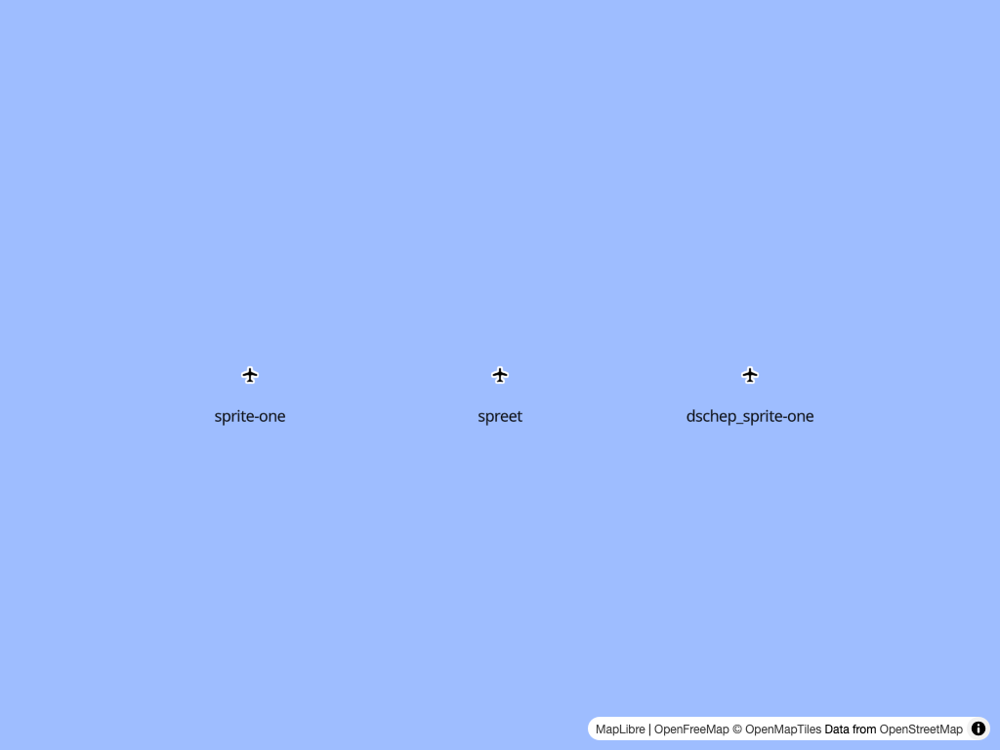
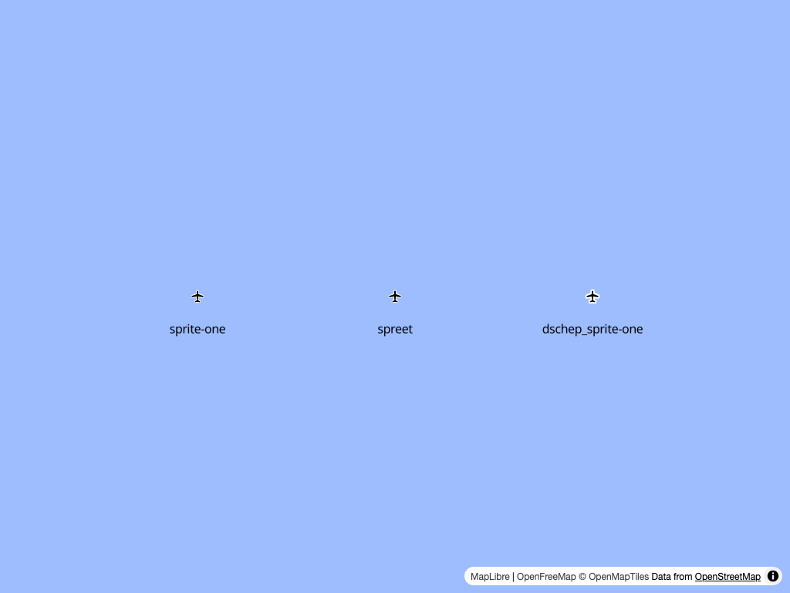

# `@unvt/sprite-one` & `spreet` SDF `--ratio` bug

Existing sprite generation tools for Mapbox/MapLibre don't create the correct buffer areas for 2x
ratio spritesheets.

[My fork](https://github.com/dschep/sprite-one) of `@unvt/sprite-one` is patched to address this
issue.

## Screenshots
This is how things look with 1x sprites, as expected:

This is how things look with 0x sprites, with the existing sprite libraries showing a smaller
buffer

## Demo

https://dschep-bug-repos.github.io/sdf-2x-generation/
